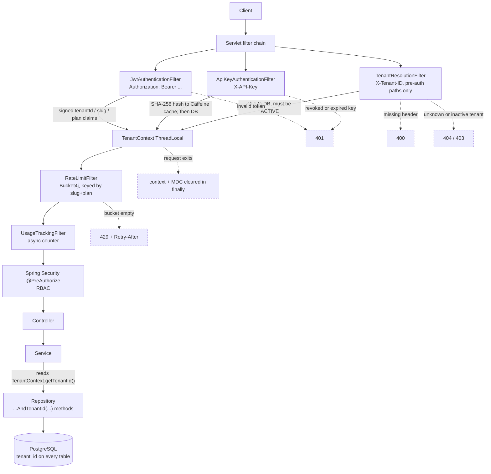

# Multi-Tenant SaaS Core Platform

A Spring Boot service core that serves many tenants from one application deployment while keeping their data isolated, with tenant identity resolved per request and enforced at the persistence layer rather than trusted from the caller.

<p align="left">
  
  
  
  
  
  
</p>

> **Status:** The core works and runs locally against a PostgreSQL instance. Tenant resolution (JWT, API key, and header), JWT access + refresh tokens, SHA-256-hashed API keys, role-based access control, per-tenant token-bucket rate limiting, AOP audit logging, per-tenant usage counters, per-tenant key/value config, and 7 Flyway migrations are all implemented. Testing is thin: **7 tests** (6 on tenant creation, 1 context-load smoke test), all `@SpringBootTest` against a real database — there is **no automated cross-tenant isolation test yet**, which is the most important gap. There is no `docker-compose.yml`, no billing, and no deployment anywhere. Known defects are listed under [Rough edges](#rough-edges) rather than hidden.

---

## The problem

Every B2B SaaS product hits the same fork early: you have one codebase and many customers, and each customer must never, under any circumstance, see another customer's rows. There are three standard ways to solve it, and they trade off along the same axis.

| Approach | Isolation | Operational cost | Fails like |
|---|---|---|---|
| Database per tenant | Strongest | Highest — N databases to migrate, back up, connect to | Connection pool exhaustion, migration drift between tenants |
| Schema per tenant | Strong | Moderate — one database, N schemas | Migration fan-out, schema count limits at scale |
| Shared schema + discriminator column | Weakest | Lowest | One forgotten `WHERE tenant_id = ?` leaks every customer's data at once |

The third option is the cheapest and by far the most dangerous, because the failure is silent. A missing predicate does not throw. It returns rows.

**This project uses shared database + shared schema with a `tenant_id` discriminator column, because it is a single-node modular monolith aimed at many small tenants: one Hikari pool of 10 connections, one Flyway migration set, one backup.** Schema-per-tenant would multiply migration runs and connection overhead for no isolation benefit this project's threat model needs yet. The cost of that choice is accepted explicitly, and the whole design below exists to pay it down: the tenant is never taken from caller-supplied data, and the context is torn down on every request exit.

---

## Architecture



### How a request carries its tenant

1. **Resolution — three entry points, one context.** A human client presents a JWT and the tenant comes from the signed `tenantId` / `slug` / `plan` claims ([`JwtAuthenticationFilter`](saas-platform/src/main/java/com/saasplatform/common/filter/JwtAuthenticationFilter.java)). A machine client presents `X-API-Key`, which is SHA-256 hashed and looked up in a Caffeine cache, falling back to the database ([`ApiKeyAuthenticationFilter`](saas-platform/src/main/java/com/saasplatform/common/filter/ApiKeyAuthenticationFilter.java)). The `X-Tenant-ID` header is accepted **only** by [`TenantResolutionFilter`](saas-platform/src/main/java/com/saasplatform/common/filter/TenantResolutionFilter.java), and only on paths where no token can exist yet — login, refresh, logout, tenant creation, Swagger, health. The tenant is never read from a request body or query parameter, because those are caller-controlled and a caller can lie.

2. **Binding.** The resolved tenant becomes a [`TenantInfo`](saas-platform/src/main/java/com/saasplatform/common/context/TenantInfo.java) record bound to a `ThreadLocal` in [`TenantContext`](saas-platform/src/main/java/com/saasplatform/common/context/TenantContext.java), plus `tenantSlug` / `userId` / `requestId` / `correlationId` in the SLF4J MDC, so every log line is attributable to a tenant. Each resolver checks `hasTenant()` first, so whichever runs first wins and the others stand down.

3. **Enforcement.** Services read `TenantContext.getTenantId()` and pass it into repository methods whose names carry the predicate — `findByIdAndTenantIdAndDeletedAtIsNull`, `findAllByTenantId`, `findByTenantIdAndKey`. Using derived query names makes `WHERE tenant_id = ?` part of the method signature, so an existing call site cannot forget it. **This sits higher than ideal, and this README will not pretend otherwise** — see the second design decision below.

4. **Fail closed.** `TenantContext` exposes two getters on purpose: `hasTenant()` / `getTenantOrNull()` for filters that must not throw, and a strict `getTenant()` that throws `IllegalStateException("TenantContext accessed outside of tenant-scoped request")` for everything downstream. Business code only ever uses the strict one. A service reached without a bound tenant fails loudly instead of falling through to a default tenant or returning an empty list — both of those hide the bug until it becomes data-breach-shaped. At the edge, a missing `X-Tenant-ID` is 400, an unknown slug is 404, and a suspended tenant is 403.

5. **Cleanup.** Every resolver clears `TenantContext` and the MDC in a `finally` block.

Point 5 is the one that bites people. `ThreadLocal` state survives the request unless you explicitly remove it, and the next request on that pooled Tomcat thread inherits it. A leaked `TenantContext` in this design is not a cosmetic bug — it is one tenant reading another tenant's rows, with a valid-looking audit trail.

---

## Design decisions worth arguing about

**Tenant identity comes from the token, not the request.**
Anything the client can set, the client can forge. This is the same instinct as never trusting a client-supplied user ID for authorization — it just moves up a level. `X-Tenant-ID` exists only on the handful of endpoints that run before a token exists, and even there the slug is resolved against the database and rejected unless the tenant is `ACTIVE`.

**Isolation is enforced in the repository contract, not in the database.**
Putting the tenant filter in the service layer means every new service method is a chance to forget it. The compromise here is Spring Data derived query names: `findByIdAndTenantIdAndDeletedAtIsNull` makes the predicate part of the signature. But nothing stops someone adding a plain `findById` tomorrow — and that method would compile, pass review if nobody is looking, and leak. The alternatives I rejected for now: a Hibernate `@Filter` / `@TenantId` (session-scoped, still opt-in, and bypassed by native queries), or **PostgreSQL row-level security** with `SET LOCAL app.tenant_id` per transaction — which is the correct end state, because the database stops trusting the application entirely. There is currently **no RLS in the schema**; grepping the migrations for `POLICY` returns nothing. This is the single biggest honest weakness of the design, and it is a deliberate staging decision rather than an oversight.

**Rate limiting and the API-key cache are deliberately in-process, and that caps the deployment at one node.**
[`RateLimitService`](saas-platform/src/main/java/com/saasplatform/ratelimit/service/RateLimitService.java) holds Bucket4j buckets in a Caffeine cache keyed by `slug:plan`, with per-plan limits (basic 100, pro 500, enterprise 2000 req/min). The alternative is Bucket4j backed by Redis, which keeps the limit correct across replicas. I chose in-memory because adding Redis to a single-instance app buys a distributed-systems failure mode and zero real capability — but it means the effective limit is *N × configured* on N replicas, and buckets reset on restart. That is a known, bounded cost. The same reasoning applies to the API-key cache.

**Bootstrap is an idempotent startup event, not a seed script.**
[`BootstrapService`](saas-platform/src/main/java/com/saasplatform/common/bootstrap/BootstrapService.java) runs on `ApplicationReadyEvent`, checks whether any `SUPER_ADMIN` exists, and if not creates one against the `platform` tenant that migration `V7` inserts. It catches `DataIntegrityViolationException`, so two instances starting simultaneously resolve the race by losing gracefully instead of crashing. It refuses to run without `BOOTSTRAP_ADMIN_PASSWORD`, and can be disabled with `BOOTSTRAP_ENABLED=false` (CI does exactly that).

---

## Running it locally

**Prerequisites:** JDK 17+ (`pom.xml` targets 17; CI and the Dockerfile build on Temurin 21), PostgreSQL 14+, Maven wrapper included.

There is **no `docker-compose.yml` in this repo yet** — bring your own Postgres, or run one directly:

```bash
git clone https://github.com/D-KAMALKALYAN/saas-multitenant-core-platform.git
cd saas-multitenant-core-platform

docker run -d --name saas-pg -p 5432:5432 \
  -e POSTGRES_USER=postgres \
  -e POSTGRES_PASSWORD=postgres \
  -e POSTGRES_DB=saas_platform \
  postgres:16

cd saas-platform

export DB_URL=jdbc:postgresql://localhost:5432/saas_platform
export DB_USERNAME=postgres
export DB_PASSWORD=postgres
export JWT_SECRET=$(openssl rand -hex 32)
export BOOTSTRAP_ADMIN_PASSWORD='ChangeMe123!'

./mvnw spring-boot:run
```

Flyway applies `V1`–`V7` on startup (`ddl-auto: validate` — Hibernate never touches the schema), then `BootstrapService` creates the first `SUPER_ADMIN`.

The API comes up on `http://localhost:8080`. Swagger UI: **`http://localhost:8080/swagger-ui/index.html`**. Health: `http://localhost:8080/actuator/health`, which includes a custom `tenant` indicator reporting the live count of non-deleted tenants.

### Configuration

Every secret is an environment variable; nothing sensitive is committed. Required: `DB_URL`, `DB_USERNAME`, `DB_PASSWORD`, `JWT_SECRET`, and `BOOTSTRAP_ADMIN_PASSWORD` (unless `BOOTSTRAP_ENABLED=false`).

| Variable | Default | Purpose |
|---|---|---|
| `SERVER_PORT` | `8080` | HTTP port |
| `SPRING_PROFILES_ACTIVE` | `dev` | `dev` \| `prod` \| `test` |
| `JWT_ACCESS_EXPIRY` | `3600000` | Access token TTL in ms — 1 hour |
| `JWT_REFRESH_EXPIRY` | `2592000000` | Refresh token TTL in ms — 30 days |
| `BCRYPT_STRENGTH` | `10` | Password hash cost factor |
| `RATE_LIMIT_BASIC` / `_PRO` / `_ENTERPRISE` | `100` / `500` / `2000` | Requests per minute per tenant |
| `BOOTSTRAP_ENABLED` | `true` | Create the first `SUPER_ADMIN` on startup |
| `BOOTSTRAP_ADMIN_EMAIL` | `admin@platform.internal` | Bootstrap admin identity |

### Checking isolation by hand

Authentication is tenant-scoped by design: you log in with a **slug plus email plus password**, and the token you get back can only ever see that tenant.

```bash
# Two tenants, two users, two tokens.
TOKEN_A=$(curl -s -X POST localhost:8080/api/v1/auth/login \
  -H 'Content-Type: application/json' \
  -d '{"slug":"acme","email":"admin@acme.com","password":"Passw0rd!"}' \
  | python -c 'import sys,json; print(json.load(sys.stdin)["data"]["accessToken"])')

TOKEN_B=$(curl -s -X POST localhost:8080/api/v1/auth/login \
  -H 'Content-Type: application/json' \
  -d '{"slug":"globex","email":"admin@globex.com","password":"Passw0rd!"}' \
  | python -c 'import sys,json; print(json.load(sys.stdin)["data"]["accessToken"])')

# Same endpoint, same code path, disjoint result sets.
curl -s localhost:8080/api/v1/users -H "Authorization: Bearer $TOKEN_A"
curl -s localhost:8080/api/v1/users -H "Authorization: Bearer $TOKEN_B"

# Acme's token asking for a Globex user id returns 404, not 403 — the row is
# invisible rather than forbidden, so the endpoint cannot be used to probe
# which ids exist inside another tenant.
curl -s -o /dev/null -w '%{http_code}\n' \
  localhost:8080/api/v1/users/$GLOBEX_USER_ID \
  -H "Authorization: Bearer $TOKEN_A"
```

Seeding those two tenants and their first admin users needs a `SUPER_ADMIN` token, and that provisioning path is currently awkward — see [Rough edges](#rough-edges). **This check is read off the code, not off a green CI run.** Turning it into an automated test is the top item on the list below, because a claim like "tenants are isolated" is worth exactly as much as the test that proves it.

---

## Testing

Honestly: 7 tests.

- [`TenantServiceTest`](saas-platform/src/test/java/com/saasplatform/tenant/TenantServiceTest.java) — 6 tests over tenant creation: happy path, duplicate-slug conflict, duplicate-email conflict, persistence, multiple tenants, full field mapping.
- [`SaasPlatformApplicationTests`](saas-platform/src/test/java/com/saasplatform/SaasPlatformApplicationTests.java) — the context loads.

Both are `@SpringBootTest` with `@ActiveProfiles("test")`, so they need a reachable PostgreSQL database named `saas_platform_test`; Flyway migrates it on each run. They are integration tests, not unit tests — no mocks, no Testcontainers.

```bash
cd saas-platform
./mvnw test
```

CI ([`.github/workflows/ci.yml`](.github/workflows/ci.yml)) runs on push and PR to `main` and `develop`: it starts a `postgres:16` service container behind a `pg_isready` health gate, sets up Temurin JDK 21 with Maven caching, and runs `mvn clean verify` against it with `BOOTSTRAP_ENABLED=false` and a throwaway JWT secret.

There are currently **two copies of this workflow**, byte-identical apart from a trailing newline: the live one at the repository root, and a duplicate at `saas-platform/.github/workflows/ci.yml`. GitHub only discovers workflows under the root `.github/workflows/`, so the nested copy never runs. It should be deleted rather than kept in sync.

---

## Project layout

The Git repository root is a thin wrapper; the application is the `saas-platform/` Maven module.

```
saas-multitenant-core-platform/
├── LICENSE
└── saas-platform/                      # Spring Boot app (Maven module)
    ├── Dockerfile                      # multi-stage, JRE 21 Alpine, non-root user
    ├── pom.xml
    └── src/
        ├── main/java/com/saasplatform/
        │   ├── common/
        │   │   ├── config/             # SecurityConfig, JwtService, OpenApi, Async
        │   │   ├── context/            # TenantContext ThreadLocal + TenantInfo record
        │   │   ├── filter/             # JWT, API key, tenant resolution, correlation id, usage
        │   │   ├── bootstrap/          # idempotent first-SUPER_ADMIN creation
        │   │   ├── exception/          # typed exceptions + @RestControllerAdvice handler
        │   │   ├── monitoring/         # custom Actuator tenant health indicator
        │   │   └── response/           # StandardApiResponse<T> envelope
        │   ├── tenant/                 # tenant CRUD + TenantValidationService (slug to active tenant)
        │   ├── user/                   # tenant-scoped users, 4 roles, soft delete
        │   ├── auth/                   # login / refresh / logout, RefreshToken entity
        │   ├── apikey/                 # SHA-256 keys, prefix display, Caffeine cache
        │   ├── audit/                  # @Auditable annotation + AOP aspect + query API
        │   ├── usage/                  # async per-tenant/day/endpoint request counters
        │   ├── tenantconfig/           # per-tenant key/value settings
        │   └── ratelimit/              # Bucket4j filter + per-plan bucket factory
        ├── main/resources/
        │   ├── application{,-dev,-prod}.yml
        │   └── db/migration/           # V1–V7 Flyway migrations
        └── test/java/com/saasplatform/ # 7 tests (see Testing)
```

### Schema

```
tenants ──┬── users ── refresh_tokens
          ├── api_keys
          ├── audit_logs        (tenant_id nullable — auth failures have no tenant yet)
          ├── tenant_configs    UNIQUE (tenant_id, config_key)
          └── usage_records     UNIQUE (tenant_id, record_date, endpoint, method)
```

### API surface

| Module | Endpoints | Access |
|---|---|---|
| Auth | `POST /api/v1/auth/login` · `/refresh` · `/logout` | public (slug in body) |
| Tenants | `POST` `GET` `GET /{id}` `PATCH /{id}` `DELETE /{id}` on `/api/v1/tenants` | `SUPER_ADMIN`; single-read and patch also `ADMIN` |
| Users | `POST` `GET` `GET /{id}` `PATCH /{id}` `DELETE /{id}` on `/api/v1/users` | role-gated, tenant-scoped |
| API keys | `POST` `GET` `DELETE /{id}` on `/api/v1/apikeys` | `ADMIN` \| `SUPER_ADMIN` |
| Audit logs | `GET /api/v1/audit-logs` | `ADMIN` \| `SUPER_ADMIN` |
| Tenant config | `GET` `PUT /{key}` `DELETE /{key}` on `/api/v1/tenant-config` | `ADMIN` \| `SUPER_ADMIN` |
| Usage | `GET /api/v1/usage` | `ADMIN` \| `SUPER_ADMIN` |
| Ops | `GET /actuator/health` public; remaining actuator endpoints `SUPER_ADMIN` | — |

Responses use a `StandardApiResponse<T>` envelope; failures are mapped centrally by `GlobalExceptionHandler`. API keys are returned in full exactly once at creation and stored only as a SHA-256 hash plus a 16-character prefix for display.

---

## Rough edges

Real defects found by reviewing this code, kept here rather than in a private notes file.

- **Filters are registered twice.** Every filter is a `@Component` *and* wired into the Spring Security chain, with no `FilterRegistrationBean` disabling the auto-registration and no `@Order` anywhere. `OncePerRequestFilter` stops each one from *executing* twice, but the consequence is that the real execution order is the undefined servlet-filter order, not the order declared in `SecurityConfig`. Since `TenantResolutionFilter` returns 400 when `X-Tenant-ID` is absent, and `JwtAuthenticationFilter` stands down whenever a tenant is already bound, that ordering is load-bearing. This is the first thing to fix.
- **Refresh tokens are stored in plaintext and never rotated.** A raw UUID goes into `refresh_tokens` as-is; `logout` revokes one, but `refresh` hands the same token back indefinitely until expiry. A single database read is a 30-day account takeover. Access tokens are fine — signed, 1 hour, never stored.
- **No row-level security.** Isolation rests entirely on application-layer discipline. See the second design decision.
- **Rate limits and the API-key cache are per-JVM.** Correct on one node, wrong on N, and reset on restart.
- **No cross-tenant isolation test.** The property this entire project exists to guarantee is the one property with no test.
- **`prometheus` is listed in the Actuator exposure list, but `micrometer-registry-prometheus` is not a dependency**, so that endpoint does not exist.
- **Version drift.** `pom.xml` targets Java 17 while CI and the Dockerfile use 21; the older module-level `saas-platform/README.md` claims Java 21 / PostgreSQL 18 and describes a filter order that double registration does not guarantee.
- **The CI workflow is duplicated**, once at the repository root (live) and once under `saas-platform/.github/workflows/` (inert). Two copies of the same pipeline will drift.
- `V3__future_feature.sql` is an empty placeholder migration, and `src/test/resources/application-test.yml` hardcodes a local database password instead of reading the environment.

## What isn't built yet

- Tenant self-service onboarding — provisioning a tenant *and* its first admin in one flow. A `SUPER_ADMIN` JWT carries no tenant context by design, so creating that first user means threading `X-Tenant-ID` through a code path that does not cleanly expect it.
- Billing, invoicing, and plan enforcement beyond rate limits. Usage is counted, never charged.
- Password reset, email verification, MFA, forced password change on first login.
- Distributed rate limiting and caching (Redis), and anything else required to run more than one instance.
- Observability beyond MDC logging and the default Actuator endpoints — no metrics registry, no tracing, no dashboards.
- Testcontainers, API-level tests, and a load test.
- An admin console or UI of any kind. This is a backend core, not a product.

Stating this openly is deliberate. A README that implies a complete product and then doesn't build is a much worse outcome than one that says exactly where the edges are.

---

## License

MIT — see [LICENSE](LICENSE).
